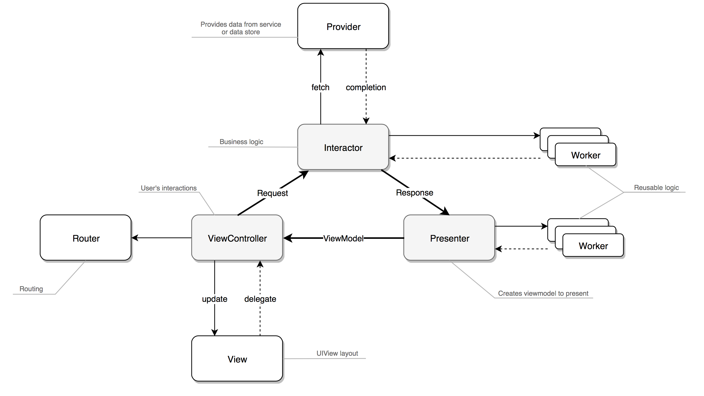

<p align="center">
  
</p>

[]()
[](https://swift.org)
[](https://travis-ci.org/alfa-laboratory/YARCH)
[](https://codecov.io/gh/alfa-laboratory/YARCH)


YARCH – это архитектурный паттерн для iOS, созданный в Альфа-Банке. Все вопросы можно задать в [Telegram](https://t.me/yarch_ios).

## Общая схема


Прочитать про компоненты YARCH можно [здесь](GUIDE-rus.md).

## Создание нового модуля
Для генерации модулей используется [generamba](https://github.com/rambler-digital-solutions/Generamba). Каталог шаблонов:
```
https://github.com/alfa-laboratory/YARCH-Template
```

Перед первым созданием модуля необходимо установить шаблоны:
```
generamba template install
```

Для создания нового модуля нужно воспользоваться командой:
```
generamba gen [MODULE_NAME] yarch --description 'Предназначение вашего модуля в одном предложении.'
```

Лицензия
--------

© 2017 Альфа-Банк. Код лицензирован MIT.
